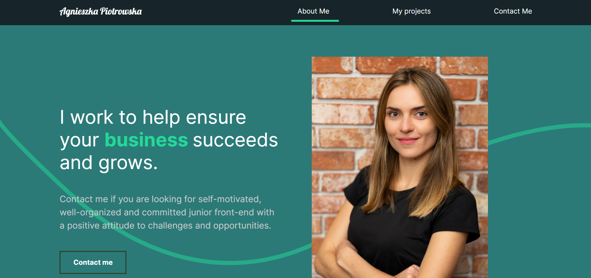

# PortfolioApp 

This is a dynamic website powered by [Create React App](https://github.com/facebook/create-react-app) that was created to present in an easy and friendly way my tech portfolio. 

## Motivation

I started this project to wrap all my previously written projects in one and at the same time to practise the use of React, styled-components and web animations.

## Content

Website consists of 3 sections. 

**About Me** section works as a simple and consistent CV page where you can find the list of my valuable skills as well as get to know in details my tech profile, work experience and educational background (section FAQ). 
 
**My Projects** section contains the list of my tech projects - including commercial projects (Forest Spa and MP Action Photo) as well as non-commercial projects (Day Planner, Music Player) - where I implemented the below technologies and frameworks. Each project has it's own description and link to see live. 
 
In **Contact Me** section you will find my contact details as well as the link to my GitHub profile. 

See live at: 

## Built with

- [Create React App](https://github.com/facebook/create-react-app) - JavaScript Framework
- [React-Router](https://github.com/ReactTraining/react-router) - Declarative routing for React.
- [styled components](https://github.com/styled-components/styled-components) - Lets you write actual CSS in your JavaScript
- [Framer Motion](https://www.framer.com/motion/) - Production-Ready Animation Library for React

## License

This project is licensed under the MIT License - see the [LICENSE](LICENSE) file for details.